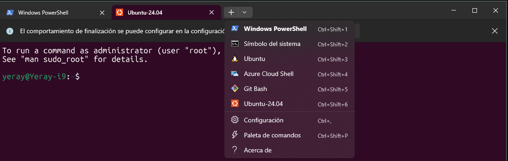

> # 🐳 Instalación de Docker + WSL + Portainer en Windows
- [🐳 Instalación de Docker + WSL + Portainer en Windows](#-instalación-de-docker--wsl--portainer-en-windows)
- [👉 Paso 1: Activar características de Windows (WSL)](#-paso-1-activar-características-de-windows-wsl)
- [👉 Paso 2: Instalación de WSL + Ubuntu 24.04](#-paso-2-instalación-de-wsl--ubuntu-2404)
  - [Powershell](#powershell)
  - [Descargar terminal](#descargar-terminal)
  - [Actualizar Ubuntu](#actualizar-ubuntu)
- [👉 Paso 3: Instalación de Docker Desktop + integración con WSL](#-paso-3-instalación-de-docker-desktop--integración-con-wsl)
    - [3.1 Instalar Docker Desktop con winget en Windows](#31-instalar-docker-desktop-con-winget-en-windows)
    - [3.2 Abrir Docker Desktop](#32-abrir-docker-desktop)
    - [Comprobar Docker desde Ubuntu](#comprobar-docker-desde-ubuntu)
- [👉 Paso 4: Portainer](#-paso-4-portainer)
    - [Instalar Portainer](#instalar-portainer)
- [Trabajo con Docker en Visual Studio Code usando WSL](#trabajo-con-docker-en-visual-studio-code-usando-wsl)
- [1. Ejecutar Visual Studio Code en Ubuntu (WSL)](#1-ejecutar-visual-studio-code-en-ubuntu-wsl)
  - [1.1 Abrir Ubuntu (WSL)](#11-abrir-ubuntu-wsl)
  - [1.2 Ir al directorio de trabajo](#12-ir-al-directorio-de-trabajo)
  - [1.3 Abrir Visual Studio Code desde Ubuntu](#13-abrir-visual-studio-code-desde-ubuntu)
  - [1.4 Comprobar que Docker funciona](#14-comprobar-que-docker-funciona)
- [2. Uso de contenedores Docker desde Visual Studio Code](#2-uso-de-contenedores-docker-desde-visual-studio-code)
  - [2.1 Crear un proyecto Python](#21-crear-un-proyecto-python)
  - [2.2 Crear un script Python](#22-crear-un-script-python)
  - [2.3 Crear un Dockerfile](#23-crear-un-dockerfile)
  - [2.4 Construir la imagen](#24-construir-la-imagen)
  - [2.5 Ejecutar el contenedor](#25-ejecutar-el-contenedor)
- [Resumen](#resumen)
Guía paso a paso para preparar un entorno con WSL, Ubuntu 24.04, Docker Desktop y Portainer.

## 👉 Paso 1: escargar terminal y activar características
La Terminal de Windows es una herramienta "todo en uno" que puedes obtener gratis desde la Microsoft Store; una vez instalada, basta con buscarla en el menú inicio para ejecutarla. Su principal ventaja es que permite abrir múltiples pestañas con diferentes entornos (como PowerShell o CMD) en una sola ventana, ofreciendo además una personalización total de colores y fuentes para que trabajar con comandos sea mucho más cómodo y visual.



Abrir Características de Windows y activar:
 - Plataforma de máquina virtual
 - Subsistema de Windows para Linux


# 👉 Paso 2: Instalación de WSL + Ubuntu 24.04

En la **terminal**

```powershell
# Instalar WSL con winget
winget install Microsoft.WSL 
# Comprobar
wsl --version

# Instalar Ubuntu 24.04
wsl --install -d Ubuntu-24.04
# Si no aparece esa versión, puedes listar disponibles con:
wsl --list --online

```
La primera vez te pedirá:  [Usuario]  [Contraseña]

**Actualizar Ubuntu**
```bash
sudo apt update && sudo apt upgrade -y && apt autoremove
```

# 👉 Paso 3: Instalación de Docker Desktop + integración con WSL

>### 3.1 Instalar Docker Desktop con winget en Windows

```powershell
winget install Docker.DockerDesktop
```

>### 3.2 Abrir Docker Desktop

1. Iniciar Docker Desktop desde el menú de inicio
2. Esperar a que termine la configuración
3. Ir a:  **Settings → Resources → WSL Integration**
4. Activar:  Ubuntu-24.04

>### Comprobar Docker desde Ubuntu

```bash
# Abrir Ubuntu y ejecutar:
docker --version
# Probar contenedor:
docker run hello-world
```

# 👉 Paso 4: Portainer

>### Instalar Portainer

Para instalar Portainer en Docker Desktop, lo más sencillo es utilizar las extensiones. Solo tienes que abrir Docker Desktop, ir a la sección Extensions en el menú lateral izquierdo y buscar "Portainer" en el buscador. Haz clic en el botón de instalar y la aplicación se encargará de descargar la imagen necesaria y configurar el contenedor de gestión automáticamente.

Una vez instalado, verás el icono de Portainer en la barra lateral. Al hacer clic por primera vez, el sistema te pedirá crear una contraseña de administrador de al menos 12 caracteres para proteger el acceso. Tras este paso, selecciona el entorno "local" para que Portainer se conecte al motor de Docker de tu ordenador y puedas empezar a ver todos tus contenedores activos.

Utilizarlo es muy intuitivo, ya que sustituye los comandos de la terminal por una interfaz gráfica. Desde el panel de control, puedes monitorizar el consumo de CPU y RAM de cada contenedor, revisar los logs en tiempo real para buscar errores o entrar directamente a la consola de una base de datos con un solo clic. Es ideal para gestionar redes y volúmenes de forma visual, algo que en Docker Desktop suele estar más limitado.

Además, una de sus funciones más potentes son los Stacks, que te permiten desplegar aplicaciones completas copiando y pegando el código de tus archivos docker-compose.yml directamente en el navegador. Esto facilita enormemente el despliegue de proyectos complejos sin tener que gestionar archivos locales constantemente.


